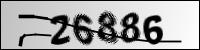

# Captcha decode

The captcha is appeard when I want to scratch website of my school library.Anyway it obstruct me for half years 
until I know Convolution network and the basic framework keras.

I use 1219 char snip cut by histgram to train my convoluntion network for 50 epoch. I'm glad to GPU accelerate the speed to 10 times.

In [46]: mod.evaluate()
('Test score:', 0.54862265454398262)
('Test accuracy:', 0.83703703703703702)

In [58]: gi=GeneralImage('data/11.jpg',standard_image,db)

In [59]: gi.im_origin
Out[59]: 

 

In [60]: gi.predict(mod,mode='max')
Out[60]: ['3', '3', '6', '8', '8', '6', '2']

It's not vrey good. It don't match one char,however I will always cut two side for final result.
